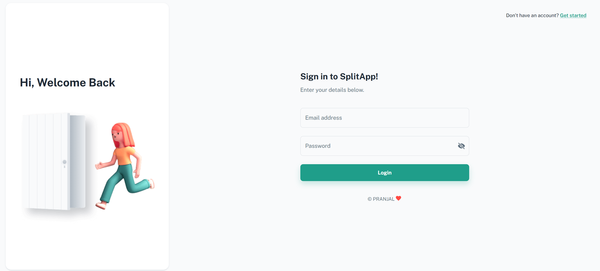
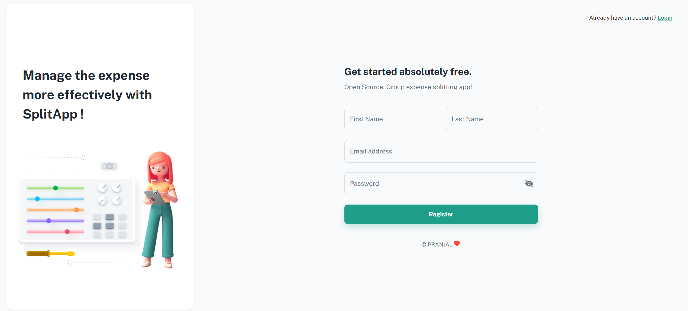
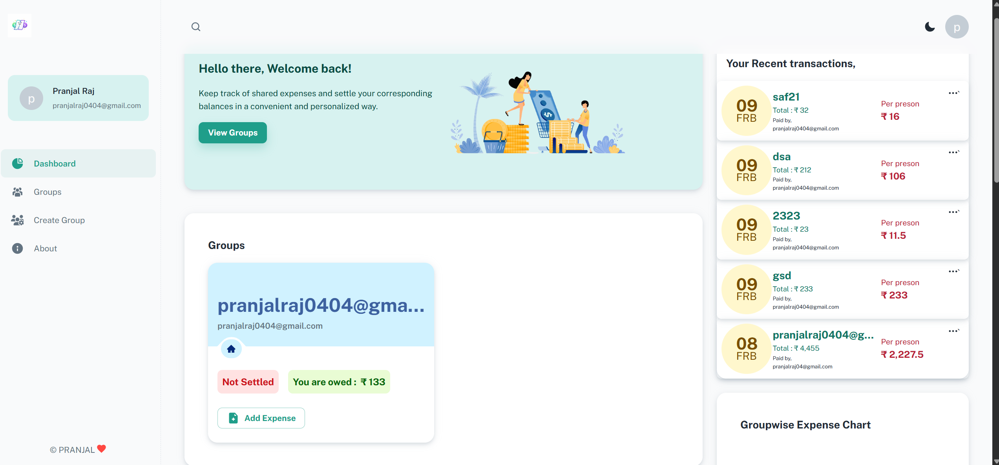
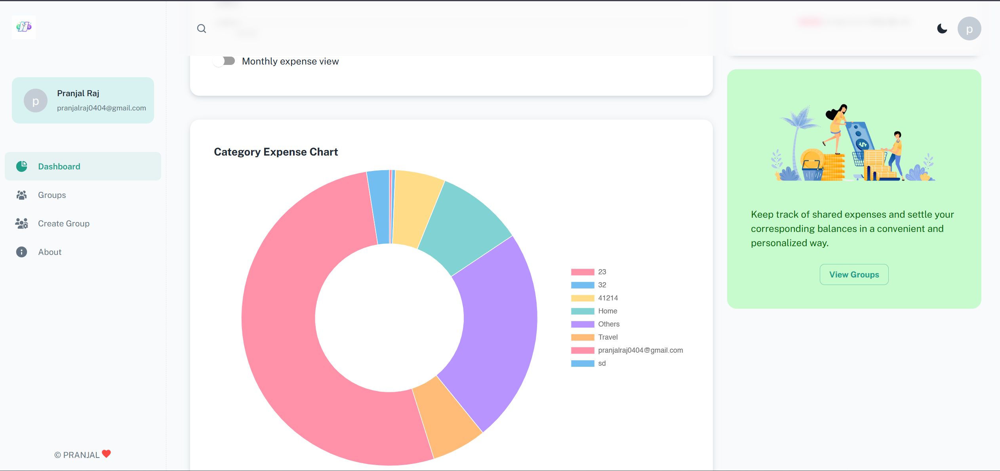

# 🚀 SplitApp – Intelligent Group Expense Tracker

A production-ready **MERN stack application** for seamless group expense tracking and automated debt settlement.

SplitApp simplifies shared finances by enabling users to create groups, log expenses, compute balances automatically, and visualize spending patterns through interactive dashboards.

---

## 🌍 Overview

Managing shared expenses in trips, hostels, or projects can get messy.  
SplitApp solves this by providing:

- Automated equal expense splitting
- Real-time balance tracking
- Group-based financial management
- Interactive analytics dashboard
- Secure authentication & protected APIs

The system is built with clean backend architecture, modular routing, secure authentication, and optimized MongoDB queries.

---

## 📸 Application Preview


### 🔐 Login Page


### 📝 Signup Page


### 📊 Dashboard


### 📈 Expense Analytics



---

## ✨ Key Features

### 🔐 Authentication & Security
- JWT-based stateless authentication
- Password hashing using bcrypt
- Protected routes via middleware
- Environment-based configuration
- Centralized validation using Joi

---

### 👥 Group Management
- Create, update, and delete groups
- Add/remove members dynamically
- Group-specific expense tracking
- Automatic debt recalculation
- Real-time balance updates

---

### 💰 Expense Tracking
- Equal split logic automation
- Category-based expense tagging
- Multi-user contribution tracking
- Transaction history logging
- Instant balance computation

---

### 📊 Analytics Dashboard
- Category-wise expense distribution
- Member contribution comparison
- Monthly expense trends
- Chart.js interactive visualizations
- MongoDB aggregation pipeline optimization

---

### 🎨 User Experience
- Fully responsive design
- Material UI interface
- Dark / Light theme support
- SPA routing with React Router

---

## 🏗️ Architecture
```
Client (React.js)  
⬇  
Express REST API (Node.js)  
⬇  
MongoDB Atlas  
```
### Design Principles
- Separation of concerns
- Modular controller-route structure
- Middleware-driven validation & logging
- Stateless authentication
- Optimized database queries

---

## 🛠️ Tech Stack

### Frontend
- React.js
- React Router

### Backend
- Node.js
- Express.js
- MongoDB Atlas
- Mongoose
- JWT Authentication
- Custom Logging Middleware

---

## 📂 Project Structure

```
SplitApp/
│
├── client/                 # React frontend
├── components/             # Controllers / Business logic
├── routes/                 # API routes
├── model/                  # Database schemas
├── helper/                 # Split logic, validation, logging
├── logs/                   # Application logs
│
├── app.js                  # Express entry point
├── check-users.js          # Utility script

```

---

## ⚙️ Installation & Setup

### 1️⃣ Clone Repository

```bash
git clone https://github.com/your-username/SplitApp.git
cd SplitApp
```

---

### 2️⃣ Install Backend Dependencies

```bash
npm install
```

---

### 3️⃣ Install Frontend Dependencies

```bash
cd client
npm install
```

---

### 4️⃣ Configure Environment Variables

Create a `.env` file in the root directory:

```env
PORT=5000
MONGO_URI=your_mongodb_connection_string
JWT_SECRET=your_secret_key
```

---

### 5️⃣ Run Application

Backend:

```bash
npm run dev
```

Frontend:

```bash
cd client
npm start
```

---

## 🧠 Engineering Highlights

- Designed scalable MongoDB schema for Users, Groups, and Expenses
- Implemented automated balance computation algorithm
- Used aggregation pipelines to optimize analytics queries
- Built centralized error-handling middleware
- Structured backend using modular REST architecture
- Integrated logging for observability and debugging
- Production-ready configuration management


---

## 📌 Author

**Your Name**  
GitHub: https://github.com/Pranjalraj0404 
LinkedIn: https://www.linkedin.com/in/pranjalraj0404
